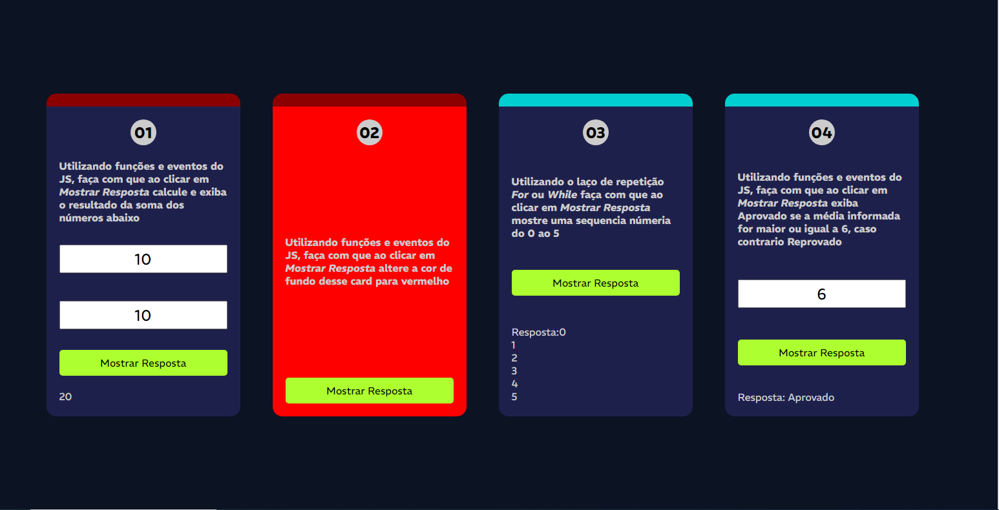

# ✔️ Prova de teste lógico 

## 💻 Sobre o projeto
Nesse projeto eu mostrava quatro quadros lógicos como:

1- Soma de dois números.
2- Se eu clicar no botão a telinha ficava vermelha.
3- Colocar uma lista de 1 à 5.
3- Era condição de uma média, menor que 6 reprovado e maior aprovado.

## 🛠 Tecnologias utilizadas

* Javascript 
* HTML
* CSS

## 🎨 Layout
 

## 🦸 Autora

<a href="">
